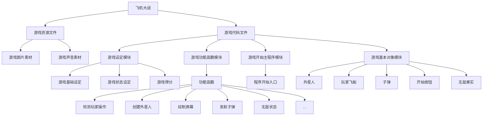

# 飞机大战

- 题目：飞机大战
- 作者:foldn
- 时间：2021年7月14日

## 实验环境

- 操作系统：Windows10
- python 版本：python3.7
- 主要用到的包：pygame，numpy, sys

## 程序结构

### 树状结构图：

## 功能模块

### 主要功能

1. 在游戏主页面点击**开始游戏**即可开始游戏
2. **P键**暂停游戏，再次点击恢复游戏
3. **ESC**退出游戏
4. **上下左右键**控制玩家飞船移动
5. **空格键**发射子弹
6. 记录游戏分数，记录最高分
7. 敌方随机生成飞船
8. 特定关卡生成BOSS群，BOSS血量增加，具有发射子弹进行攻击能力
9. 按时投放无敌果实，玩家获得即可进入无敌状态（免疫碰撞）
10. 敌方飞船随机移动，随着关卡越来越厚，地方飞船移动速度越来越快
11. 游戏背景音乐

### 主要模块

#### 游戏对象模块

##### alien_plane.py（外星人模块）

##### 	bullet.py（子弹模块）

##### 	ship.py（玩家飞船模块）

##### button.py（开始按钮模块）

##### invincible_food.py（无敌果实模块）

#### 游戏设定模块

##### settings.py（游戏基础设定）

##### game_stats.py（游戏状态设定）

##### scoreboard.py（游戏得分）

#### 游戏功能函数模块

##### game_functions.py（功能函数）

- 检测玩家操作
- 创建外星人
- 绘制屏幕
- 发射子弹
- 无敌状态设定
- ...

#### 游戏开始程序模块

##### main.py（主程序）

## 算法说明

无

## 使用说明

###### 文件使用说明：

点击飞机大战.zip进行解压，解压完成后打开项目，进入主程序文件（main.py），执行代码，点击游戏界面中央开始游戏按钮即可开始游戏

###### 玩家操作：

上箭头：飞船前进

下箭头：飞船后退

左箭头：飞船左移

右箭头：飞船右移

键盘按键空格：发射子弹（按一次发射一次）

ESC：退出游戏

键盘按键P：游戏暂停，再次点击游戏继续

###### 游戏规则：

玩家操作飞船抵御外星飞船的进攻，每次敌军随机生成一支飞船舰队进行进攻。玩家操作飞船将所有的飞船击毁将进入下一关，当关卡为BOSS关卡时，敌方会生成BOSS飞船，BOSS飞船拥有更高的血量以及发射子弹进行攻击的能力

###### 飞船死亡判定：

被敌方子弹击中，玩家飞船与敌方飞船撞击，在非无敌状态下被敌方飞机冲破防线（到达页面底端）

###### 无敌状态判定：

游戏每隔一段时间会投放无敌果实，玩家飞船得到无敌果实将会免疫敌方子弹以及敌方飞船本身的碰撞，同时防线也将进入无敌状态，被敌方飞机冲破防线将不会导致飞船死亡